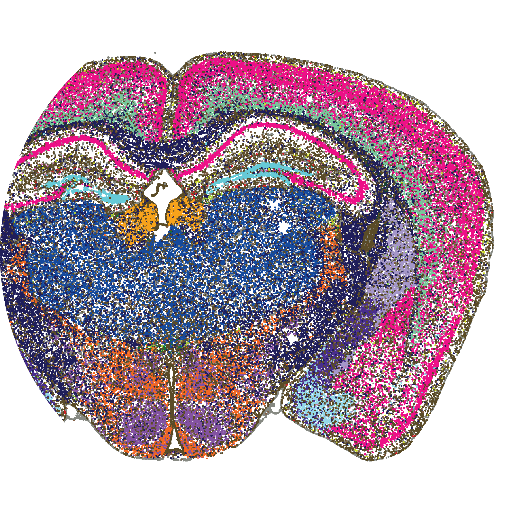
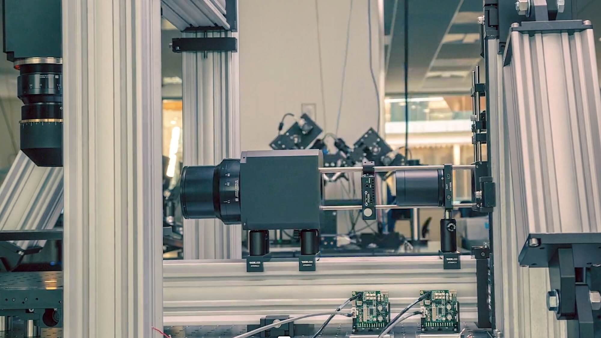

# The Allen Institute for Brain Science Uses Generative AI Tools to Unlock the Mysteries of the Human Brain

## Overview and Origin

[The Allen Institute](https://alleninstitute.org/) for Brain Science is a non-profit research organization founded in 2003 by Paul G. Allen and four employees with the goal of trying to understand the inner workings of the human brain along with the human immune system by mapping an entire mammalian brain.

Paul G. Allen, being a philanthropist himself, launched the company with $100 million of his own resources and continued to gain support from the government like the National Science Foundation (NSF), National Institutes of Health (NIH) and other private donors through open calls and invitation.

## Business Activities

The Allen Institute for Brain Science's hallmark project is the [Brain Knowldge Platform](https://portal.brain-map.org/atlases-and-data/bkp) (BKP), which is aimed to be the largest open-source database of brain cell data in the world. By leveraging the technology of Amazon Wed Services (AWS), the BKP will host the [Allen Brain Cell](https://portal.brain-map.org/atlases-and-data/bkp/abc-atlas) (ABC) Atlas which will be the first largest data set if its kind to standardize the massive datasets of structure and function of mammalian brains.

Seen below is the a visualization of multimodal single cell data across the mammalian brain with the hopes to explore and analyze multiple whole-brain datasets simultaneously.

One of the biggest challenges of current research in neuroscience is the overwhelming complexity of the brain and vast amounts of data that isn't centralized or organized in meaningful way.

The goal of the BKP and ABC Atlas is to create a comprehensive knowledge base to better diagnose and treat mental and neurological disorders and diseases such as Alzheimer's and Parkinson's disease which affects millions of people worldwide. These are two of the most common neurodegenerative diseases that could accelerate our understanding and treatments along with many other brain disorders.

Unlike other projects the BKP and ABC Atlas proposes invaluable and accelerated multimodal characterization of brain cell types in the the following disciplines of study:

* [Anatomy](https://portal.brain-map.org/anatomy)
* [Cell Types](https://portal.brain-map.org/cell-types)
* [Circuits & Behavior](https://portal.brain-map.org/circuits-behavior)
* [Connectivity](https://portal.brain-map.org/connectivity)
* [Computational Modeling & Theory](https://portal.brain-map.org/explore/models)
* [Gene Expression](https://portal.brain-map.org/gene-expression)
* [Genetic Tools](https://portal.brain-map.org/computational-tools)

With the help of AWS and machine learning tools, vast amounts of data can be analyzed and segmented to discover new insights that aren't initially obvious. Generative AI will allow integration of other data types to bring new insights to make predictions that typically wouldn't be possible with human researchers.

## Brain Mapping with Generative AI

The BKP leverages Generative AI to map the human brain by analyzing massive datasets of brain scans to understand and identify patterns and connections between different brain regions. The ABC Atlas models brain networks and can predict brain activity based on specific stimuli to better understand neural functions to identify potential abnormalities in brain disorders.

Computational analysis tools from the Allen Institute scientists have been made public to encourage an open and collaborative community. Following are a few example of tools and used:

* [Cell Type Mapper](https://github.com/AllenInstitute/cell_type_mapper) - "A python package for mapping single cell RNA sequencing data on a cell type taxonomy"

* [mfishtools](https://github.com/AllenInstitute/mfishtools) - "Package for gene selection and analysis of spatial transcriptomics data, including MERFISH."

* [scrattch.bigcat](https://github.com/AllenInstitute/scrattch.bigcat) - "Package for clustering analysis for extremely large single cell dataset."

A comprehensive list of tools can be seen [here](https://portal.brain-map.org/computational-tools).

## Landscape

The landscape of neuroscience for studying degenerative brain diseases and disorders is still a vast unknown field with many interdisciplines. There are many other companies and organizations like the Allen Institute taking on the intimidating task of understanding the human brain like AC Immune, Biogen, Neutrope Inc and AXON Neuroscience just to name a few. Even though the term 'neuroscience' was coined in the 1960s, ancient civilizations has have made observations of the brain and nervous system as early as 6th century B.C. among Egyptian, Greek and Roman scholars. For example, ancient Egyptian physicals understood that injury to the spinal cord could result in paralysis and brain lesions affecting speech functions.

In the 20th century, the invention of the electron microscope and functional MRI have allowed greater insights into the brain and nervous system, emboldening the renaissance for research. In just the last 10 years of modern neuroscience, there have been several breakthroughs. Brain-computer interfaces (BCIs) are being developed by the [Brain Gate Project](https://www.braingate.org/) to decode movement from electrical signals int he motor cortex. BCIs are used to study visual signals as well as less tangible brain issues such as OCD, depression, addiction and other psychiatric disorders.

Other breakthroughs in neurosciences include brain organoids which resemble mini brains those of preterm babies to understand development, neural implants to treat Parkinson's, deep learning to create complex AI models of neural processing, and many more.

## Results

The Allen Institute has greatly impacted the neuroscience community by providing a vast, openly accessible database of brain cell connectivity through the ABC Atlas which has revealed over 3000 cell types and distinct features. It lays the groundwork a complete cell catalogue for future work and research.

Though the ABC Atlas is probably the greatest contributing impact the Allen Institute has thus far, they have contributed to other areas of study like the aging immune system, the claustrum, a mysterious brain region, and building on the ExA-SPIM microscope which takes slices of mouse brain to view individual neurons at incredible resolution.

> "‘ExA-SPIM’ microscope borrows from electronics industry to image incredible detail in an entire mouse brain"

Core metrics of measuring the success of the Allen Institute are not only the breakthroughs in neuroscience, but the amount of support and collaboration they have inspired through private donors and the use of the ABC Atlas. It has already been used by tens of thousands of people each month and with its start in 2003, it has received over $100 million in donations. Other companies like Neuralink, Jülich Research Centre and Omniscient Neurotechnology, do similar research in brain mapping and atlases but the Allen Institute is widely regarded the leading organization in comprehensive detailed cell type identification and connectivity maps. Coined as the 'Allen Impact,' the Allen Institute is widely celebrated among the neuroscience community as place of disciplined research and innovation.

> "Our research and data are empowering scientists to pursue bold solutions to the most pressing issues affecting humanity." - Rui Costa, D.V.M., Ph.D. President and Chief Executive Officer, Allen Institute

## Recommendations

The use of ABC Atlas brain maps opens up a world of possibilities and applications. The Allen institute is well known for their collaborative efforts by [soliciting proposals](https://alleninstitute.org/division/neural-dynamics/openscope/) and having an [online forum](https://community.brain-map.org/).

Psychedelics and psychoactive drugs have become a large topic of discussion in clinical and recreational settings so it would be interesting to apply atlas maps to understand exactly how these drugs affect the brian and how plasticity is achieved. There has been a lot of research done in this area so it would be interesting to further that research to give us more insights about the pros and cons.

Atlas Maps could also open up the possibility of studying the efficacy and effectiveness of drugs treating mental illnesses. Clinical trials usually involve carefully tracking side effects against a placebo, but not much is understood about how they actually affect the brain. Atlas Maps can give higher resolution to understanding how cell groups are affected and how patterns change.

These and other applications would further benefit and add value to the Allen Institute, solidifying the important work in creating libraries of brain maps.

Aside from using brain maps for human research, perhaps these could be used to study other closely related species like apes or even similarly intelligent mammals like dolphins. Understanding the physiology of other mammalian brains could lead to new insights in understanding human brains as it is found in nature that brain patterns exist across different species.

What the Allen Institute is doing to uncover the mysteries of the brains is an invaluable endeavor that has profound and massive impacts to the neuroscience community and beyond.

> "You look at things you enjoy in your life, but much more important is what you can do to make the world a better place." - Paul G. Allen

## Resources

* Allen Brain Map. Brain Knowledge Platform. https://portal.brain-map.org/atlases-and-data/bkp

* Allen Brain Map. Allen Brain Cell Atlas. https://portal.brain-map.org/atlases-and-data/bkp/abc-atlas

* Allen Institute. 20 Years of Allen Impact. https://alleninstitute.org/allen20/#:~:text=In%202003%2C%20the%20Allen%20Institute,the%20world%20had%20never%20seen

* Allen Institute. Open Calls for Science Funding. https://alleninstitute.org/division/frontiers-group/open-calls-science-funding/#:~:text=Through%20funding%20from%20the%20Paul,traditional%20funders%20or%20by%20industry

* Allen Institute. 20 Years of Impact: 2023 Annual Report. https://alleninstitute.org/news/20-years-of-impact-2023-annual-report/#:~:text=Years%20in%20the%20making%2C%20researchers,a%20vital%20global%20scientific%20resource.

* Amazon Web Services (2023 Aug 2). How AWS generative AI tools are helping to unlock the human brain.  https://www.youtube.com/watch?v=B3t0_Wc-Yq0

* BMC Med Genet (2018 Dec 31). Parkinson’s disease and Alzheimer’s disease: a Mendelian randomization study. https://pmc.ncbi.nlm.nih.gov/articles/PMC6311900/#:~:text=Background-,Alzheimer

* Fan, Shelly (2020 Jan 5). These Breakthroughs Made the 2010s the Decade of the Brain. https://singularityhub.com/2020/01/05/these-breakthroughs-made-the-2010s-the-decade-of-the-brain/

* Kuceyeski, Amy Dr. (2023 Nov 30). Scientists Use A.I.-Generated Images to Map Visual Functions in the Brain. https://news.weill.cornell.edu/news/2023/11/scientists-use-ai-generated-images-to-map-visual-functions-in-the-brain

* Vilhauer, Monica Ph.D. (2023 Dec 18). A Brief History of Neuroscience. https://www.psychologytoday.com/intl/blog/consciousness-and-beyond/202312/a-brief-history-of-neuroscience#:~:text=Ancient%20Egyptians%20knew%20about%20neurology,fluid%20(Ehrlich%2C%202022).

* Tompa, Rachel (2023 July 11). New OpenScope projects aim to shed light on how we process our visual world. https://alleninstitute.org/news/new-openscope-projects-aim-to-shed-light-on-how-we-process-our-visual-world/